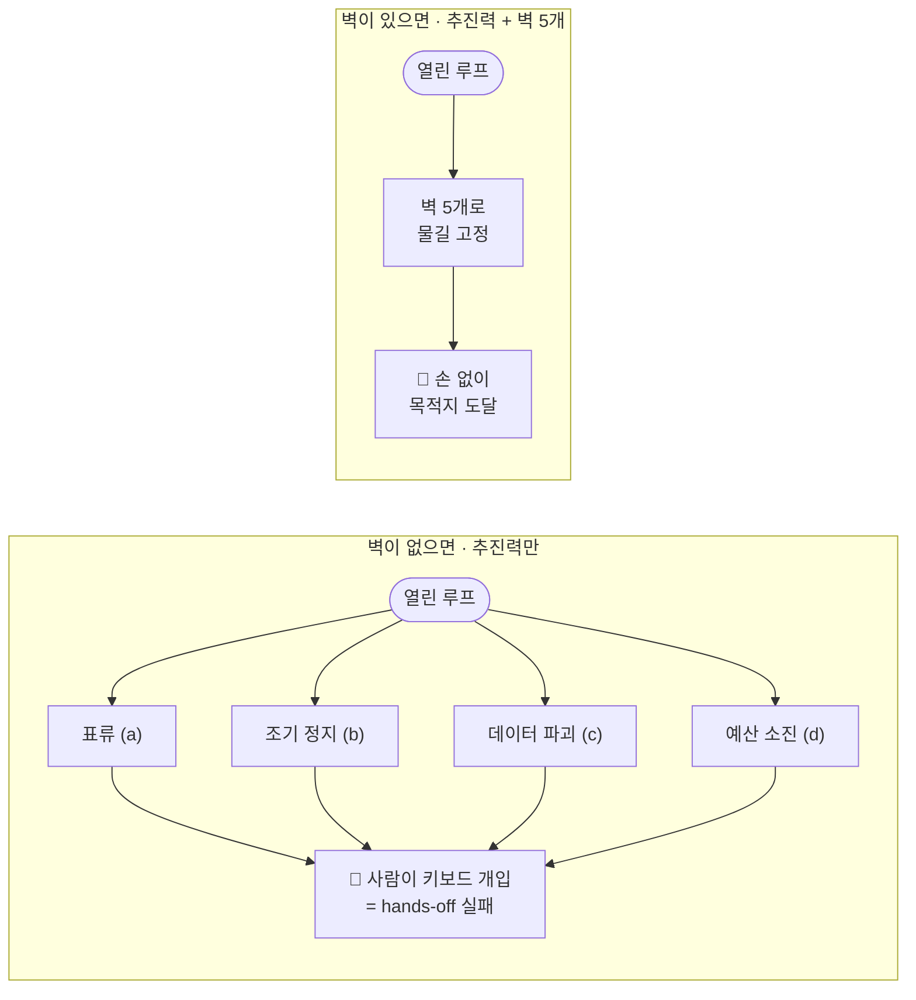
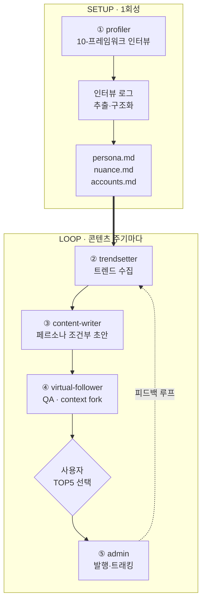
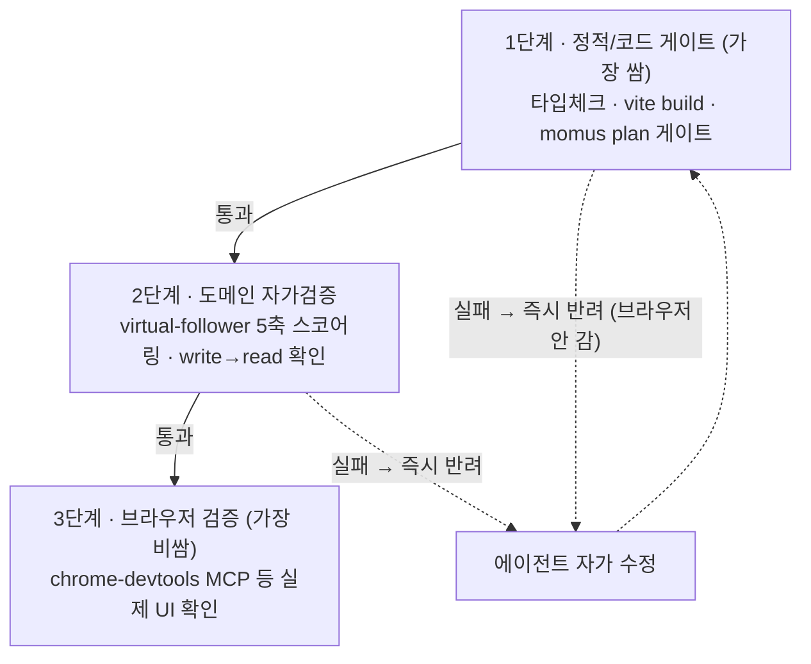
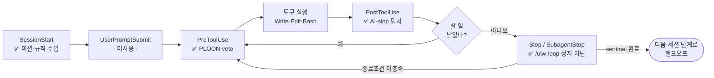
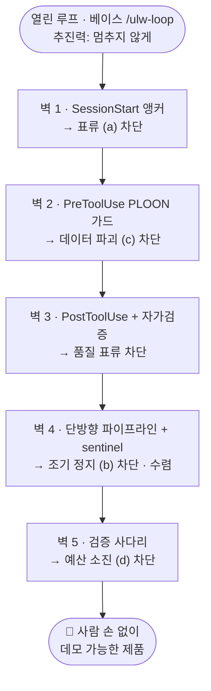

# 하네스 엔지니어링 케이스 스터디 — Polysona

### 에이전트가 "손 안 대고" 5시간 만에 제품을 완성하게 만든 설계

> **이 교재로 배우는 것**: 공용 베이스 하네스(루프 엔진) 위에, 에이전트가 *표류하지 않고 멈추지 않고 망가뜨리지 않고 시간을 낭비하지 않게* 만드는 **통제면(control surface)·파이프라인·프롬프트 설계**를 단계별로 분해한다.
> 모든 설계 주장은 공개 저장소 `LilMGenius/polysona`의 실제 파일에 `파일:라인`으로 근거를 단다(재현 가능). 베이스 엔진은 출처를 정직하게 구분 표기한다.

---

## 0. 문제 정의 — Hands-off Hackathon이 요구하는 것

Ralphthon은 **참가자가 5시간 동안 키보드에 손을 대지 않고**, 에이전트만으로 제품을 완성하는 대회다. 사람이 한 번이라도 개입하면 "hands-off"가 깨진다. 따라서 설계의 목표는 단 하나로 수렴한다:

> **사람이 개입해야만 하는 순간을 0으로 만든다.**

에이전트가 자율 루프에서 사람을 부르게 되는 전형적 실패 모드는 네 가지다:

| | 실패 모드 | 사람이 개입하게 되는 이유 |
|---|---|---|
| **(a)** | **표류(drift)** | 미션을 잊고 엉뚱한 걸 만든다 → 사람이 "원래 목표"를 다시 넣어줘야 함 |
| **(b)** | **조기 정지(early stop)** | "다음에 뭘 할까요?" 하고 멈춰 기다린다 → 사람이 다음 지시를 줘야 함 |
| **(c)** | **데이터 파괴(destruction)** | 누적 자산을 덮어써 망가뜨린다 → 사람이 복구해야 함 |
| **(d)** | **예산 소진(budget burn)** | 느린 브라우저 자동화에 시간을 태운다 → 사람이 흐름을 바로잡아야 함 |

Polysona의 설계는 이 **네 실패 모드를 각각 구조적으로 차단**한다. 그래서 "물을 부으면 배수관을 따라 흐르듯", 에이전트가 사람 손 없이 목적지(데모 가능한 제품)까지 흘러간다. 이 교재는 그 배수관의 벽들을 하나씩 뜯어본다.

---

## 1. 두 개의 레이어 — 베이스 엔진 vs 커스텀 레이어

핵심 통찰부터: **루프를 "멈추지 않게 하는 것"과 루프를 "목적지로 수렴시키는 것"은 다른 문제다.**

- **베이스 루프 엔진**은 에이전트가 멈추지 않고 계속 일하게 만든다. 하지만 *방향*은 주지 않는다 — 열어두기만 하면 에이전트는 계속 일하면서도 엉뚱한 곳으로 갈 수 있다.
- **커스텀 레이어**(통제면 + 파이프라인 + 프롬프트)가 그 열린 루프에 *벽*을 세워 방향을 준다.

| 레이어 | 구성 | 출처 | 근거 |
|---|---|---|---|
| **베이스 (loop engine)** | `/ulw-loop`·ralph-loop(루프 지속), `.sisyphus` boulder(세션 간 sentinel 조율), `momus`(QA 게이트), `PLAN_FOR_POLYSONA.md`(북극성 미션) | OmO 생태계 — **로컬 전용(저장소 미포함)** | `.gitignore:147-148`(`.ref/`, `.sisyphus/`), `decks/slide-outline.md:59`("운영 방식: ralph-loop with ulw"), 운영 프롬프트 |
| **커스텀 레이어** | 라이프사이클 훅 3종, 에이전트-강제 규칙(CLAUDE.md/AGENTS.md), 5 에이전트·8 스킬 파이프라인, 듀얼 런타임 플러그인, hono 대시보드 | 저장소에 커밋된 본 프로젝트 산출물 | §3 전 항목 `파일:라인` |

> Karpathy의 autoresearch 철학(에이전트가 스스로 검증·축적하며 굴러가게 한다)과 OmO 루프 철학을 *베이스*로 삼고, 그 위에 도메인(페르소나)·런타임(Codex/Claude)·품질(검증) 제약을 얹어 깎아낸 것이 커스텀 레이어다.

---

## 2. 커스텀 레이어 = 통제면 + 파이프라인

아래 2a~2g가 §0의 네 실패 모드를 각각 어떻게 막는지 보여준다. 각 항목은 **(1) 무엇을 했는가 → (2) 저장소 근거 → (3) Claude Code 공식 훅 의미론**으로 구성한다.

### 2a. 미션 앵커링 — 표류(a) 차단
**SessionStart 훅**이 매 세션·재개·컨텍스트 압축 시점마다 활성 페르소나 요약과 핵심 규칙을 자동 주입한다.

- 근거: `hooks/session-start.sh:14-19` — 매 세션에 *"No speculation, Facts first / PLOON format / Append, never overwrite / 10 frameworks, 5 ego layers"* 재주입.
- 근거: `CLAUDE.md` — **에이전트가 따라야 할 규칙을 문서화**: 7대 철학(`:7-13`), 예외 없는 행동 규칙(`:17-20`: no-speculation, 단일 진실원천 SSOT), **Context Loading Protocol**(`:26-34`: 작업 트리거별 *필수 읽기* 매핑), 그리고 `:46`의 반(反)환각 앵커 — *"frameworks: 10 … Not 14."* 처럼 *틀리면 안 되는 사실*을 못 박음.
- 공식 의미론: SessionStart는 `additionalContext`를 주입하는 이벤트다. 루프가 길어지고 컨텍스트가 압축돼도 북극성이 사라지지 않게 하는 *미션 메모리 자동 재장전* 용도다.

### 2b. 도구 사전 게이팅 — 데이터 파괴(c) 차단
**PreToolUse 훅**이 파괴적 쓰기를 실행 전에 가로챈다.

- 근거: `hooks/pre-tool-use.sh:9-13` — `Write`가 `personas/*`를 *Read 없이* 건드리면 경고: *"compressed core를 덮어쓰지 말고 interview-log에만 append."*
- 공식 의미론: PreToolUse는 `tool_name`/`tool_input`을 검사해 **exit 2 또는 `permissionDecision:"deny"`로 도구를 차단**하거나 `updatedInput`으로 입력을 교정할 수 있는, 실행 *전* 단계의 유일한 관문. 여기에 PLOON append-only 불변식을 박아 누적 페르소나 자산 파괴를 원천 차단했다.

### 2c. 출력 사후 검증 — 품질 표류 차단
**PostToolUse 훅**이 결과물의 AI-slop(상투적 장황체) 패턴을 자가 탐지한다.

- 근거: `hooks/post-tool-use.sh:8-10` — 출력에 `certainly|absolutely|as an AI|I'd be happy to` 등이 보이면 *"verbosity 검토"* 경고.
- 공식 의미론: PostToolUse는 이미 실행된 도구라 차단은 못 하지만, **다음 턴에 `additionalContext`로 피드백을 주입**해 모델이 스스로 교정하게 만든다.

### 2d. 루프 지속 + 종료 조건 — 조기 정지(b) 차단
베이스의 `/ulw-loop`가 루프를 *열어두는* 힘이라면, 커스텀 레이어는 그 열린 루프에 **수렴할 종료 조건**을 준다. (지속과 수렴은 별개 설계라는 §1의 통찰이 여기서 구현된다.)

- 근거: 운영 프롬프트 — 서브세션은 작업을 끝내면 `.sisyphus/dashboard2-complete` **sentinel 파일**을 떨어뜨리고, 그걸 **리더 세션이 감지해 PR 병합**으로 이어간다. → 멈추지 않되, *아무 데서나*가 아니라 *정의된 완료 신호*에서만 다음 단계로 넘어간다.
- 근거: 에이전트 스펙에 **자가 검증을 의무화**: `agents/virtual-follower.md:21-24` — *"MUST use Write to save … MUST immediately Read to confirm … Only after successful Read verification, return …"*, 그리고 `:24` *"If the write fails, say it failed. Do not pretend."* (= 완료 주장 전 검증을 에이전트 규칙에 내장.)
- 공식 의미론: Stop / SubagentStop / TeammateIdle은 exit 2로 **정지·유휴를 막아 계속 일하게** 만드는 이벤트군. "멈추지 마"라는 운영 지시는 이 계열의 의미를 프롬프트 차원에서 구동한 것이다.

### 2e. 파이프라인 = 배수관 (5 에이전트 · 8 스킬)
미션이 앵커되고(2a) 파괴가 막히고(2b) 품질이 자가검증되고(2c) 루프가 종료조건까지 열려 있으면(2d), 마지막으로 필요한 것은 **에이전트가 흐를 단일한 물길**이다.

- 근거: `AGENTS.md:5-11` + `README.md:96-110` — SETUP(`profiler`→구조화→`persona/nuance/accounts.md`) → LOOP(`trendsetter`→`content-writer`→`virtual-follower`(QA)→사용자 선택→`admin` publish/track). **단방향 파이프라인**이라 에이전트가 "다음에 뭘 하지"를 스스로 추론할 여지가 작다 = 표류 면적 최소화.
- 근거: `skills/qa/SKILL.md:5-6` — `context: fork` + `agent: virtual-follower`. **QA를 생성 컨텍스트에서 격리**해, 자기가 쓴 글을 자기가 후하게 평가하는 편향을 차단한다.
- 근거: 데이터 규약 `CLAUDE.md:38-42` — **Markdown 전용 · Git as DB · PLOON 압축 테이블**. 상태가 전부 파일이라, 한 세션이 죽어도 다음 세션이 git에서 그대로 이어받는다(= boulder 조율과 맞물린 지속성).

### 2f. 검증 사다리 & 브라우저 최소화 — 예산 소진(d) 차단
컴퓨터/브라우저 자동화는 **클릭 → 추론 → 클릭** 사이마다 LLM 추론 지연이 끼어 *구조적으로 느리다.* 5시간 예산에서 이걸 1순위 검증 수단으로 쓰면 시간이 증발한다. 그래서 검증을 **싼 것 먼저, 비싼 것 나중**으로 사다리화한다:

1. **정적/코드베이스 게이트(싸고 빠름)**: 타입 체크(`tsconfig.json`), `vite build`(`package.json:9`)가 1차 컴파일·구조 게이트. plan→`momus` 게이트(SDD), 에이전트 자가검증(write→read, 2d).
2. **도메인 자가검증**: `virtual-follower`의 5축 스코어링(`agents/virtual-follower.md:36-41` — hook/empathy/share/CTA/platform)으로 콘텐츠 품질을 *코드 레벨에서* 시뮬레이션.
3. **비싼 브라우저 검증은 최후에만**: 위 싼 게이트를 통과한 산출물에 한해 chrome-devtools MCP 등으로 실제 UI를 확인. 운영 프롬프트도 *"Codex CLI, Claude Code, Dashboard에서 직접 검증"* 으로 코드/CLI 우선을 명시한다.

> **원리**: 검증을 *비용 순서*로 사다리화하면, 같은 시간에 더 많이 만들고(싼 게이트가 대부분을 걸러줌) 느린 검증은 꼭 필요할 때만 돌린다.

### 2g. 속도 엔지니어링 — 출발선에서 앞서기
hands-off는 *준비를 어디까지 미리 해뒀나*의 싸움이기도 하다.

- **사전 프론트엔드**: `client/`(React 19 + Vite 7 + Tailwind v4, `vite.config.ts`)가 이미 스캐폴딩돼 있어, 대회 중엔 *기능만* 붙이면 된다.
- **빌드/런타임 경량화**: `server/index.ts`가 **hono** + `hono/bun`의 `serveStatic`로 정적 자산과 API를 한 프로세스에서 서빙(`package.json:14`, `server/index.ts:2-12`). `bun run dev = vite build && bun server`(`package.json:8`) — 무거운 프레임워크 없이 빌드·기동이 빠르다.
- **듀얼 런타임 즉시 구동**: `.claude-plugin/{plugin.json,marketplace.json}`로 Claude Code 플러그인 즉시 설치, `agents/openai.yaml` + `scripts/sync-codex-skills.mjs`(skills를 `.agents/skills`로 미러)로 **Codex에서도 바로** 동작(`AGENTS.md:31-36`). 한 코드베이스가 두 런타임에서 도는 portability가 곧 단일 런타임 장애에 대한 리스크 분산이다.

---

## 3. 프롬프트를 "계기(instrument)"로 다루기

운영 프롬프트는 단순 지시문이 아니라 **모델의 출력 방향을 조정하는 계기**다. 구성 요소:

- **감정 = 조향 입력**: *"우승은 발끝도 못 따라가겠다 / 다른 사람들이 훨씬 잘 만든다"* 같은 **긴박·열세** 표현을 한두 문장으로 압축 주입한다. LLM은 인간의 감정 표현 분포를 방대하게 학습했으므로, 이런 표현은 출력을 *"분발/정밀/끝까지"* 방향으로 강하게 늘인다. 사실 보고가 아니라 **방향성 입력**으로 쓰는 것이 요점.
- **논리로 벡터 고정**: 감정으로 늘인 방향은 반드시 *논리적 제약*으로 좁혀야 폭주(over-engineering)하지 않는다. 운영 프롬프트는 버저닝 재배치(사진/영상은 v2, 영어는 v3)와 **역할 한정**(*"너는 dashboard의 plan·implement·polish·quality up만 담당"*)으로 방향을 고정한다.
- **미션 재앵커**: *"PLAN_FOR_POLYSONA.md를 계속 읽어 궁극적 미션을 잃지 마"* — 2a의 SessionStart 앵커와 이중으로 미션을 붙든다.
- **정량 종료 타깃**: *"품질 90점까지"* 처럼 *수렴 타깃을 숫자로* 박아, 루프가 언제 다음 단계로 넘어갈지 판단 가능하게 한다.
- **완료 핸드오프**: sentinel 파일(2d)로 세션 간 작업을 넘긴다.

> **원리**: 프롬프트의 감정은 *조향 입력*이고, 논리 제약(역할 한정·정량 타깃·미션 재앵커)은 *고정 장치*다. 둘은 짝으로 써야 한다 — 감정만 있으면 폭주하고, 제약만 있으면 추진력이 약하다.

---

## 4. 통제면 설계 표 — 어느 이벤트에 무엇을 거는가

Claude Code의 공식 훅 이벤트 의미론에 비춰, Polysona가 *어디에 무엇을 걸었고* *어디를 더 걸 수 있는지* 정리한다. 먼저 한 턴의 라이프사이클에서 각 훅이 어디서 발화하는지 본다. (출처: §부록 B.)

| 목적 | 이벤트 | 차단 가능? | Polysona 사용 |
|---|---|---|---|
| 미션·컨텍스트 주입 | **SessionStart** | ✗ (주입 전용) | ✅ `session-start.sh` 핵심 규칙 재장전 |
| 위험 프롬프트 차단 | UserPromptSubmit | ✓ (exit 2) | 미사용 (확장 가능) |
| **도구 사전 veto** | **PreToolUse** | ✓ (`deny`/`updatedInput`) | ✅ PLOON 덮어쓰기 가드 |
| 출력 사후 검증 | **PostToolUse** | ✗ (다음 턴 컨텍스트 주입) | ✅ AI-slop 탐지 |
| **조기 정지 차단** | **Stop / SubagentStop** | ✓ (exit 2) | ✅ (베이스 `/ulw-loop`로 구동) |
| 팀 유휴 차단 | TeammateIdle | ✓ (exit 2) | 미사용 (멀티세션 확장 가능) |
| 컨텍스트 압축 보호 | PreCompact | ✓ (exit 2) | 미사용 (작업 중 압축 금지로 확장 가능) |
| 권한 자동 응답 | PermissionRequest | ✓ (allow/deny) | 미사용 (무인 자동 승인으로 확장 가능) |

**확장 가능 지점(현재 미구현)**: 권한 자동 승인(PermissionRequest), 작업 중 압축 금지(PreCompact), 외부 SaaS 연동을 위한 **custom MCP**. custom MCP는 현재 저장소에는 없고 `README.md:137`의 로드맵 **v1.6** 항목이다 — 즉 현시점의 통제면은 *훅 + 스킬 + 플러그인 + 에이전트*로 구성된다.

> **원리**: 통제면 배치 근거는 *이벤트의 의미*다. 시작점에는 SessionStart(앵커), 실행 전에는 PreToolUse(veto), 실행 후에는 PostToolUse(검증), 종료 지점에는 Stop(지속). "필요한 곳에만 촘촘히"는 곧 *이벤트 의미에 맞춰 최소한으로* 거는 것이다.

---

## 5. 인과 종합 — 배수관 모델

추진력(열린 루프)만 있고 벽이 없으면 물은 사방으로 샌다 — 표류·정지·파괴·예산소진 중 하나가 터질 때마다 사람이 키보드로 물길을 막아야 한다. 다섯 벽을 미리 세워두면, 물이 알아서 목적지로 흐른다. 이것이 "손 안 대고"의 공학적 정체다.

---

## 6. 핵심 원칙 (정리)

1. **루프는 *열고* 동시에 *수렴*시켜라** — 지속(Stop-block/ulw)과 종료 조건(sentinel·정량 타깃)은 별개 설계다.
2. **통제면은 이벤트 의미에 맞춰 배치하라** — SessionStart=앵커, PreToolUse=veto, PostToolUse=검증, Stop=지속.
3. **파이프라인을 배수관으로** — 단방향 흐름 + 트리거별 필수 읽기 + 자가검증 의무 + 컨텍스트 격리로 표류 면적을 최소화.
4. **검증을 비용으로 사다리화하라** — 싼 정적/자가검증 먼저, 느린 브라우저/computer-use는 최후에만.
5. **상태를 파일·git에 두라** — 세션이 죽어도 다음 세션이 그대로 이어받게.
6. **준비가 절반** — 프론트 스캐폴드·경량 빌드(hono)·듀얼 런타임 패키징을 미리.
7. **프롬프트의 감정은 조향 입력** — 반드시 논리 제약(역할 한정·정량 타깃·미션 재앵커)으로 고정.

---

## 부록 A. 재현용 증거 맵 (설계 주장 ↔ 저장소 근거)

| 설계 요소 | 근거 상태 | 위치 |
|---|---|---|
| 라이프사이클 훅 3종(pre/post/session) | 커밋됨 | `hooks/{hooks.json,pre-tool-use,post-tool-use,session-start}.sh` |
| 미션 앵커링 규칙 | 커밋됨 | `session-start.sh:14-19`, `CLAUDE.md:22-34,44-51` |
| 5 에이전트·8 스킬 파이프라인 | 커밋됨 | `agents/*`, `skills/*`, `.claude-plugin/plugin.json` |
| 듀얼 런타임(Codex/Claude) | 커밋됨 | `agents/openai.yaml`, `scripts/sync-codex-skills.mjs`, `AGENTS.md:31-36` |
| 사전 프론트엔드 | 커밋됨 | `client/`, `vite.config.ts` |
| hono 경량 빌드/런타임 | 커밋됨 | `package.json:8-14`, `server/index.ts:2-12` |
| 자가검증(write→read) 의무 | 커밋됨 | `agents/virtual-follower.md:21-24` |
| 검증 사다리·브라우저 최소화 | 운영 방식(프롬프트+momus+자가검증으로 증거화) | 운영 프롬프트, `tsconfig.json`, `package.json:9` |
| `/ulw-loop`·boulder·momus·PLAN | 베이스(로컬 전용, gitignore) | `.gitignore:147-148`, `decks/slide-outline.md:59` |
| custom MCP 통제면 | 미구현(로드맵) | `README.md:137` (v1.6) |

## 부록 B. 공식 출처 (Claude Code 훅)

- Hooks Reference — https://code.claude.com/docs/en/hooks.md
- Hooks Guide — https://code.claude.com/docs/en/hooks-guide.md
- Docs Map — https://code.claude.com/docs/llms.txt

차단(exit 2 또는 JSON `decision`/`permissionDecision`) 가능 이벤트: PreToolUse · UserPromptSubmit · Stop · SubagentStop · TeammateIdle · PreCompact · PermissionRequest 등. 비차단(컨텍스트 주입·반응 전용): SessionStart · PostToolUse · Notification 등.
